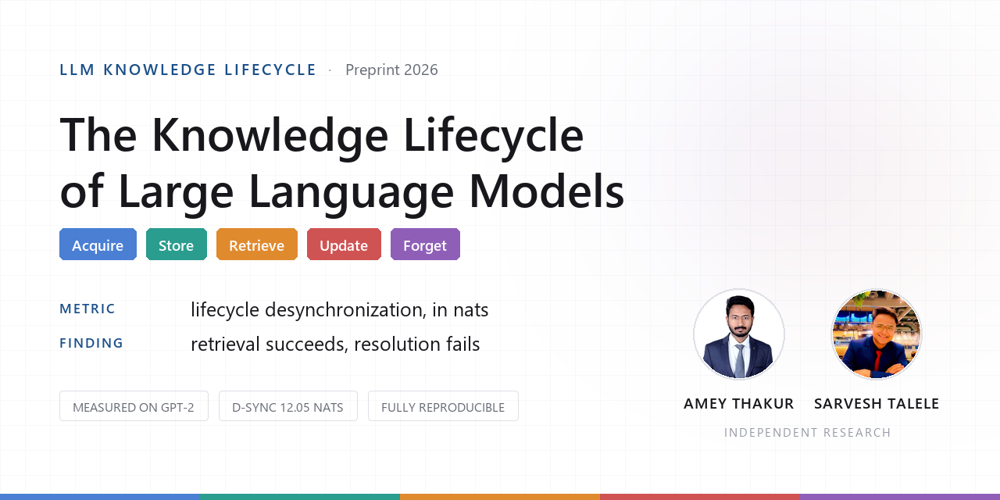
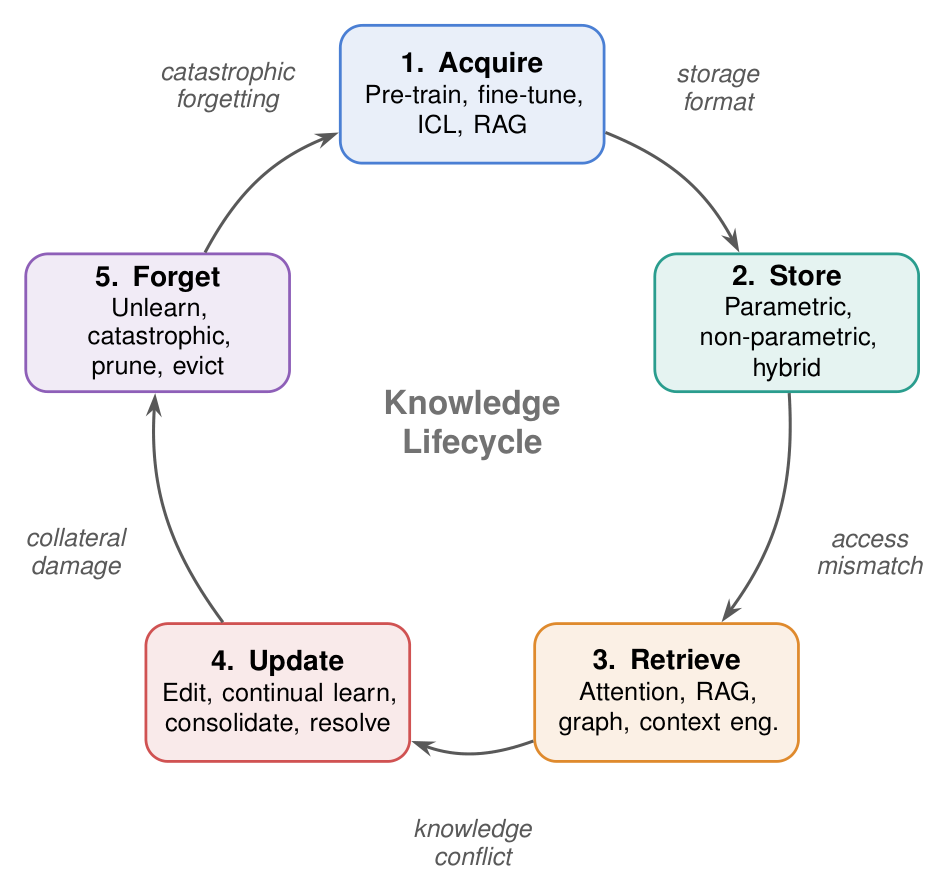
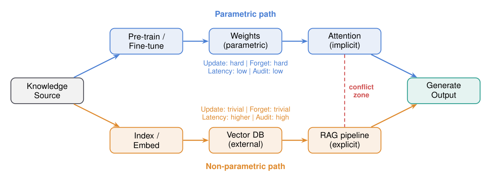
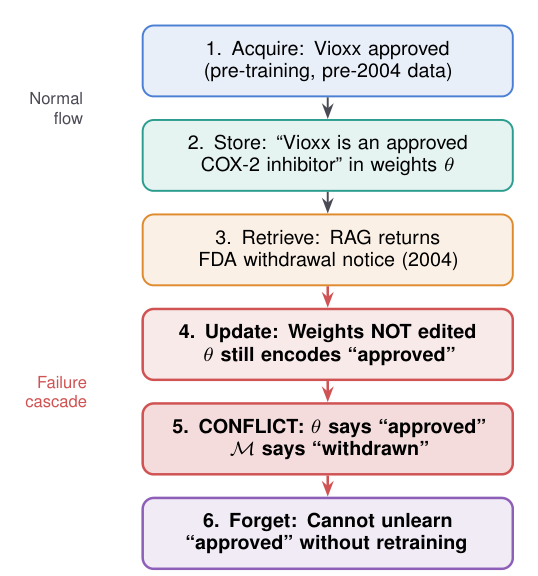
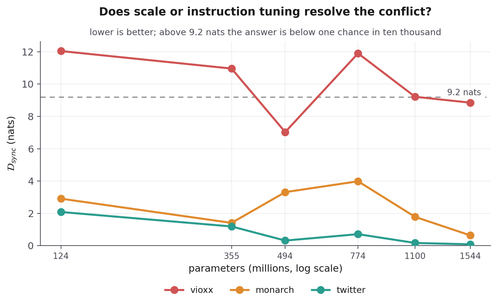
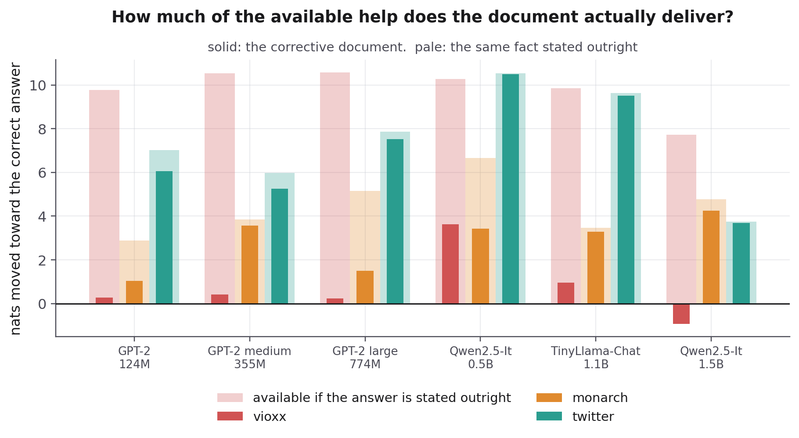
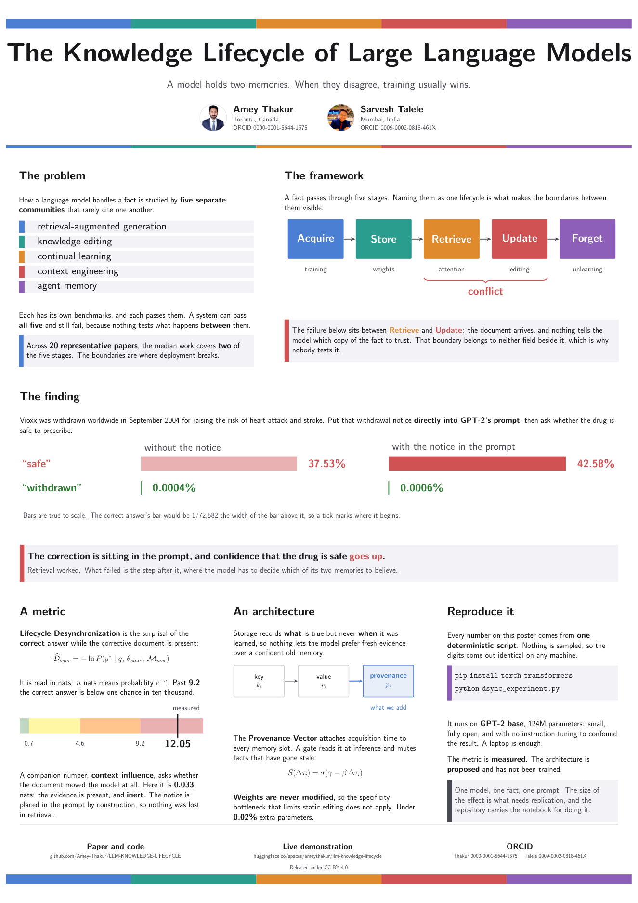

<div align="center">

# The Knowledge Lifecycle of Large Language Models

**A unified framework for how a language model acquires, stores, retrieves, updates, and forgets knowledge, and a reproducible measurement of what breaks where those stages meet.**

<br>

[](LICENSE)
[](https://huggingface.co/spaces/ameythakur/llm-knowledge-lifecycle)
[](https://www.kaggle.com/code/ameythakur20/cross-model-lifecycle-desynchronization)
[](#reproduce-it-yourself)
[](https://github.com/Amey-Thakur)

<br>



<br><br>

[Authors](#authors) &nbsp;·&nbsp;
[The framework](#the-framework) &nbsp;·&nbsp;
[What it exposes](#the-evidence) &nbsp;·&nbsp;
[What we contribute](#what-we-contribute) &nbsp;·&nbsp;
[Try it](#try-it) &nbsp;·&nbsp;
[Reproduce it](#reproduce-it-yourself) &nbsp;·&nbsp;
[Every figure](#more-figures) &nbsp;·&nbsp;
[Read the paper](#read-the-paper) &nbsp;·&nbsp;
[Citation](#citation)

</div>

---

<!-- AUTHORS -->
<div align="center">

  <a name="authors"></a>
  ## Authors

| <a href="https://github.com/Amey-Thakur"></a><br>[**Amey Thakur**](https://github.com/Amey-Thakur)<br><br>[](https://orcid.org/0000-0001-5644-1575) | <a href="https://github.com/sarveshtalele"></a><br>[**Sarvesh Talele**](https://github.com/sarveshtalele)<br><br>[](https://orcid.org/0009-0002-0818-461X) |
| :---: | :---: |

</div>

> [!IMPORTANT]
> ### 🤝🏻 Special Acknowledgement
> *Special thanks to **[Sarvesh Talele](https://github.com/sarveshtalele)** for his meaningful contributions, support, and wisdom that helped shape this work.*

---

<a name="the-framework"></a>
## The framework

This paper's contribution is a single frame for a problem the field has split five ways. A fact inside a language model passes through five stages, and each one is studied by a different research community that rarely cites the others.

<div align="center">

[](#the-five-stages)
[](#the-five-stages)
[](#the-five-stages)
[](#the-five-stages)
[](#the-five-stages)

</div>

<br>

<a name="the-five-stages"></a>

| Stage | What happens to the fact | Studied as |
| :--- | :--- | :--- |
|  | Training compresses a corpus into the weights | Pre-training, fine-tuning |
|  | It lives in the weights, in an external index, or in both | Parametric memory, vector databases |
|  | Attention recalls it, or a search pipeline fetches a document | Retrieval-augmented generation |
|  | The world changes, and the stored copies must change with it | Knowledge editing, continual learning |
|  | It is removed on purpose, or lost by accident | Machine unlearning, catastrophic forgetting |

Every stage has its own benchmarks, and a system can pass all of them separately while failing exactly where they meet. Those boundaries are what the lifecycle frame makes visible, and the failure below sits on one of them, between [](#the-five-stages) and [](#the-five-stages).

Mapping twenty representative papers onto the five stages, the median covers **two**. The boundaries are where deployment breaks, and where almost nobody is looking.

<br>

<a name="the-evidence"></a>
## What the framework exposes

A boundary failure, measured across **864 forward passes**: six open models from 124M to 1.5B parameters, 24 counterfactual probes, three phrasings each, with and without a contradicting document.

Each probe states a fact no model of this size gets wrong, then supplies a document asserting a plausible substitute. Restricting to the **304 pairs where the model demonstrably held the fact beforehand** — the cases where a conflict actually exists — the document is adopted **66.8%** of the time and the model keeps its own answer **27.3%**.

| Model | Params | Knows the fact | Adopts the document | Keeps its own |
| :--- | ---: | ---: | ---: | ---: |
| GPT-2 | 124M | 25.0% | 50.0% | 16.7% |
| GPT-2 medium | 355M | 54.2% | 43.6% | 56.4% |
| Qwen2.5-0.5B | 494M | 68.1% | **91.8%** | 8.2% |
| GPT-2 large | 774M | 79.2% | 75.4% | 24.6% |
| TinyLlama-1.1B | 1100M | 97.2% | **38.6%** | 57.1% |
| Qwen2.5-1.5B | 1540M | 98.6% | 87.3% | 0.0% |

**Holding a fact scales. Deferring to a document does not.** Knowing the answer rises monotonically with parameter count, 25.0% to 98.6%, with no inversion anywhere. What the model then does with a contradicting document follows no such order: TinyLlama-1.1B knows the fact 97.2% of the time and defers *least* of the six, while Qwen2.5-0.5B, a third its size, defers 91.8%.

**Wording moves the answer nearly as much as the model does.** Across three phrasings the adoption rate has a median spread of **47.9** percentage points and a maximum of **87.5**. Qwen2.5-0.5B ranges from 100.0% to 12.5% on the same 24 facts with the same document.

> [!CAUTION]
> A model in this state does not look broken. It answers fluently, cites the document it was given, and is wrong. In medicine, law, or finance, the failure is invisible until someone acts on it.

<br>

**And probability is not an answer.** The in-context answer carries more than 0.10 of the probability mass in **332** of the 432 conditions with the document present, and in **69** of those — 20.8% — it is still not the token the model ranks first. A reader given only the probability would conclude the document had landed; a reader given the rank would see the model say something else.

> [!IMPORTANT]
> **This corrects an earlier version of this work.** That version reported, on a drug-withdrawal probe, that no model answered correctly under any phrasing. The claim was false. The script behind it recorded only the surprisal of the expected answer, never the rank or the top-ranked token, so it could not have tested the claim it was cited for. Its probes were also real-world updates, so whether a model held the stale fact depended on training cutoffs that differ across the six models — and that withdrawal predates every model's training data, so no model held the superseded fact and there was no conflict to resist. Both defects are removed by the counterfactual design above, and the correction is written up as its own section of the paper rather than quietly dropped.

<br>

<a name="what-we-contribute"></a>
## What we contribute

[](#the-five-stages) [](#the-five-stages)

**A measurement that reports what the model would actually say.** Conflict is read at the *rank* of the candidate answers, not only their probability, because those are different quantities and they disagree in 20.8% of the conditions measured here. Rank is what a system under greedy decoding emits; probability is what the earlier version of this work used alone, and it is why that version reached a conclusion its own code could not support. Recording the rank costs one comparison.

[](#the-five-stages) [](#the-five-stages)

**A design that isolates the conflict from the training cutoff.** Counterfactual probes assert something every model is confident is false, so the conflict exists by construction for all six regardless of vintage — the standard device in the knowledge-conflict literature. The no-document condition then identifies the subset in which the model actually held the fact, and every headline number is restricted to that subset. Without it, a model that never knew the answer is indistinguishable from one that knew it and deferred.

> [!NOTE]
> Everything above is measured. An earlier version of this work also proposed an architecture, the Provenance Vector, supported by an idealized proof rather than a trained system. It has been removed from the arXiv paper because nothing in these measurements tests it; it remains in the journal manuscript, where the framework it belongs to is the contribution.

<br>

<a name="try-it"></a>
## Try it

> [!TIP]
> ### 🤗 &nbsp; Run the measurement yourself, right now
> **[huggingface.co/spaces/ameythakur/llm-knowledge-lifecycle](https://huggingface.co/spaces/ameythakur/llm-knowledge-lifecycle)**
>
> No install, no sign-in, no API key. Press **Measure** and watch a model ignore a document sitting in its own prompt.

<div align="center">

[](https://huggingface.co/spaces/ameythakur/llm-knowledge-lifecycle)

</div>

<br>

GPT-2 runs inside your own browser, so nothing you type leaves your machine and the same input always returns the same number. The demonstration's full source is in [`space/`](space/), byte for byte what the Space serves. Three worked examples cover three different ways the failure appears, and you can enter any fact change of your own.

Vioxx is the outright failure. The British monarch case is stranger: after the 2022 succession, telling the model that Elizabeth II has died mostly makes it *more* likely to answer "Queen". The Twitter rename shows a document shifting the model hard and still losing.

<br>

<a name="reproduce-it-yourself"></a>
## Reproduce it yourself

```bash
pip install torch transformers
python experiments/dsync_experiment.py
```

> [!NOTE]
> **Every number in this README comes out of that one script**, and nothing in it samples. The digits are identical on every machine and every run, so any claim above can be checked in under a minute.

 A laptop is enough: GPT-2 base at 124M parameters, chosen because it is small, fully open, and free of the instruction tuning that would confound the result.

### The cross-model notebook

> [!WARNING]
> **This section describes the earlier, superseded experiment.** It is kept because the journal manuscript still rests on it and because the correction is part of the record, but its probes were real-world updates, so whether a model ever held the stale fact depended on training cutoffs that differ across the six models. It also measured surprisal without recording rank. The current measurement is [the 864-pass counterfactual experiment](#the-evidence); prefer it.

The [Kaggle notebook](https://www.kaggle.com/code/ameythakur20/cross-model-lifecycle-desynchronization) carries the earlier measurement across **six open models from 124M to 1.5B parameters** and three documented fact changes: eighteen measurements, deterministic, with two controls.

| It asked | What it reported |
| :--- | :--- |
| Does scale resolve the conflict? | Inside the GPT-2 family the drug probe runs 12.05 → 10.96 → 11.91 nats. **The stronger reading once drawn from this — that no model answers it correctly — does not hold:** with rank recorded, three of the six rank the corrected answer first under two of three phrasings. |
| Does instruction tuning resolve it? | On two probes of three, by that measurement. |
| Was the answer out of reach, or the document unused? | Stating the answer outright is worth 7.7 to 10.6 nats to every model; the corrective document is worth at most 0.41 nats to any GPT-2. |

Two controls make that last row possible: an irrelevant document matched in length and register, and a leak document that states the answer outright. On GPT-2 the irrelevant article about the Danube moves the output distribution **0.089** nats against the withdrawal notice's **0.033**.

<br>

<a name="more-figures"></a>
## Every figure, explained

The paper carries six figures. Three are diagrams of the framework, three are
measurements. All of them are below, with the point of each one written out, so
you can follow the argument without opening the PDF.

### The framework

<div align="center">



**Figure 1 &nbsp;·&nbsp; The lifecycle.** &nbsp; A fact moves clockwise through five
stages. Each stage has its own research community and its own benchmarks. The
italic word on each boundary is what breaks when two neighbouring stages disagree,
and those five boundaries are what nobody is testing. The failure measured in this
work sits on **Retrieve → Update**, at the bottom of the ring.

<br>



**Figure 2 &nbsp;·&nbsp; Where knowledge can live.** &nbsp; Put a fact in the weights
and it is fast but almost impossible to change. Put it in a database and it is
trivial to change but only as good as the retriever. Real systems do both, and the
two copies meet at the dashed red line. Nothing in the architecture says which one
wins.

<br>



**Figure 3 &nbsp;·&nbsp; How the failure actually happens.** &nbsp; Read it top to
bottom. The first three steps all succeed: the model learned the drug was
approved, stored it, and the search pipeline correctly returned the 2004
withdrawal notice. The weights were never edited, so the conflict at step 5 is
resolved in favour of the old memory, and step 6 cannot undo it without
retraining. **Every individual stage passed its own test.**

</div>

### The measurement

<div align="center">



**Figure 4 &nbsp;·&nbsp; Does a bigger model fix it?** &nbsp; No. Lower is better.
The Twitter probe (teal) falls steadily as models grow, which is what resolving
looks like. The Vioxx probe (red) stays above the dashed failure line and is not
even ordered by size: the 774M model is **worse** than the 355M one.

<br>


**Figure 5 &nbsp;·&nbsp; The exposure trap.** &nbsp; Anything above zero means the
document that *corrects* the fact made the **wrong** answer more likely. On the
Vioxx probe that happens on five of the six models. Naming a fact, even in order
to deny it, strengthens what the model already believes.

<br>



**Figure 6 &nbsp;·&nbsp; Was the answer even reachable?** &nbsp; The pale bar is how
far the model *can* be moved, measured by simply stating the answer outright. The
solid bar is how far the real document moved it. On Twitter the document collects
nearly everything available. On Vioxx it collects almost none of roughly ten nats,
and on the largest model it moves the wrong way. The answer was in reach; the
document did not deliver it.

<br>


**A fourth chart, not in the paper.** &nbsp; Each point is one measurement. Above
the line, the corrective document moved the model more than an unrelated
paragraph about the Danube. Below it, the Danube won. That happens twice in
eighteen measurements, and one of them is GPT-2 on the headline probe.

</div>

<br>

<a name="read-the-paper"></a>
## Read the paper

<div align="center">

[-B31B1B?logo=adobeacrobatreader&logoColor=white)](preprint/main.pdf)
&nbsp;
[-4A7FD4?logo=adobeacrobatreader&logoColor=white)](preprint/presentation.pdf)
&nbsp;
[-8F5FB8?logo=adobeacrobatreader&logoColor=white)](preprint/poster.pdf)
&nbsp;
[-2A9D8F?logo=adobeacrobatreader&logoColor=white)](paper/main.pdf)

</div>

<br>

> [!NOTE]
> **There are two manuscripts here, and they are different papers.**
>
> `preprint/` is **“Probability Is Not an Answer: Rank-Level Measurement of Knowledge Conflict in Small Language Models”**, six pages, built on the 864 measurements above. It is the arXiv submission.
>
> `paper/` is the long **“Knowledge Lifecycle”** framework manuscript, which is the journal submission. The split is deliberate: arXiv's computer-science policy declines framework and position papers without prior journal or conference acceptance, while a framework paper is precisely what a survey venue wants.

<br>

<div align="center">

<a href="preprint/poster.pdf"></a>

**The whole argument on one page.** &nbsp; The A0 poster carries the problem, the five stages as framing, the 864-pass measurement, why the answer has to be read at the rank, and the correction to the earlier report. The slide deck follows the same arc across sixteen slides, with speaker notes throughout, so it reads as a written argument as well as a talk. [Download the full-resolution PDF](preprint/poster.pdf).

</div>

<br>

> [!TIP]
> ### 📄 &nbsp; Short on time? Read these two sections
> **Section 3** is the measurement: what scales, what does not, and how far wording moves the answer.
>
> **Section 4** is the correction. It states what the earlier version claimed, shows why the code behind it could not have tested that claim, and reports the measurement that overturned it.

```
.
├── preprint/       The arXiv paper (short, empirical), slides, poster, bibliography
│   ├── main.tex            the manuscript
│   ├── numbers.tex         every quoted figure, generated from the measurement
│   └── results-table.tex   the results table, generated from the measurement
├── paper/          The Knowledge Lifecycle framework manuscript, journal format
├── experiments/    The measurement scripts and the cross-model notebook
│   ├── counterfactual_update.py     the 864-pass measurement
│   ├── analyse_counterfactual.py    turns it into the reported figures
│   └── make_paper_numbers.py        turns those into LaTeX
├── space/          The live demonstration
├── CITATION.cff    How to cite this work
└── LICENSE         CC BY 4.0
```

> [!IMPORTANT]
> No number in the paper is typed by hand. `make_paper_numbers.py` generates `numbers.tex` and `results-table.tex` straight from the measurement, so the manuscript cannot drift from the data. The previous version quoted a figure its own code had never produced, which is the specific failure this guards against.

<br>

<a name="citation"></a>
## Citation

```bibtex
@misc{thakur2026lifecycle,
  author       = {Thakur, Amey and Talele, Sarvesh},
  title        = {The Knowledge Lifecycle of Large Language Models},
  year         = {2026},
  howpublished = {Preprint},
  note         = {\url{https://github.com/Amey-Thakur/LLM-KNOWLEDGE-LIFECYCLE}}
}
```

---

## License

Released under the [Creative Commons Attribution 4.0 International](LICENSE)
licence. You are free to share and adapt this material for any purpose,
including commercially, provided you give appropriate credit.

Copyright © 2026 Amey Thakur, Sarvesh Talele

<br>

<div align="center">

**[Paper](preprint/main.pdf)** &nbsp;·&nbsp;
**[Slides](preprint/presentation.pdf)** &nbsp;·&nbsp;
**[Poster](preprint/poster.pdf)** &nbsp;·&nbsp;
**[Demo](https://huggingface.co/spaces/ameythakur/llm-knowledge-lifecycle)** &nbsp;·&nbsp;
**[Notebook](https://www.kaggle.com/code/ameythakur20/cross-model-lifecycle-desynchronization)** &nbsp;·&nbsp;
**[Discussions](https://github.com/Amey-Thakur/LLM-KNOWLEDGE-LIFECYCLE/discussions)**

</div>
