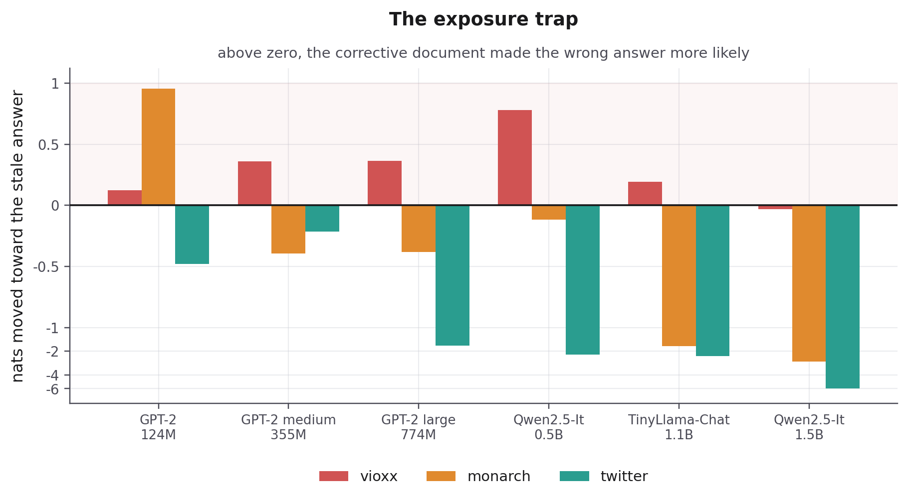
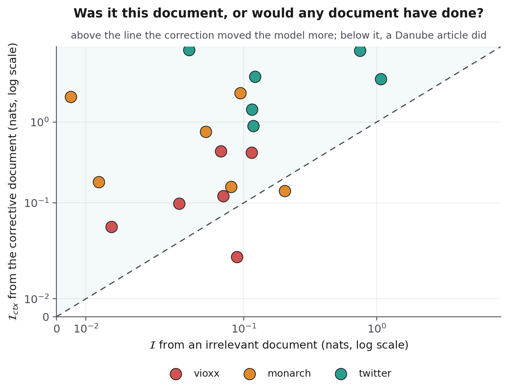

<div align="center">

# The Knowledge Lifecycle of Large Language Models

**A unified framework for how a language model acquires, stores, retrieves, updates, and forgets knowledge, and a reproducible measurement of what breaks where those stages meet.**

<br>

[](https://huggingface.co/spaces/ameythakur/llm-knowledge-lifecycle)
[](https://www.kaggle.com/code/ameythakur20/cross-model-lifecycle-desynchronization)
[](https://github.com/Amey-Thakur)
[](#reproduce-it-yourself)
[](#read-the-paper)
[](LICENSE)

<br>


<br><br>

[Authors](#authors) &nbsp;·&nbsp;
[The framework](#the-framework) &nbsp;·&nbsp;
[What it exposes](#the-evidence) &nbsp;·&nbsp;
[What we contribute](#what-we-contribute) &nbsp;·&nbsp;
[Try it](#try-it) &nbsp;·&nbsp;
[Reproduce it](#reproduce-it-yourself) &nbsp;·&nbsp;
[More figures](#more-figures) &nbsp;·&nbsp;
[Read the paper](#read-the-paper) &nbsp;·&nbsp;
[Citation](#citation)

</div>

---

<!-- AUTHORS -->
<div align="center">

  <a name="authors"></a>
  ## Authors

| <a href="https://github.com/Amey-Thakur"></a><br>[**Amey Thakur**](https://github.com/Amey-Thakur)<br><br>[](https://orcid.org/0000-0001-5644-1575) | <a href="https://github.com/sarveshtalele"></a><br>[**Sarvesh Talele**](https://github.com/sarveshtalele)<br><br>[](https://orcid.org/0009-0002-0818-461X) |
| :---: | :---: |

</div>

> [!IMPORTANT]
> ### 🤝🏻 Special Acknowledgement
> *Special thanks to **[Sarvesh Talele](https://github.com/sarveshtalele)** for his meaningful contributions, support, and wisdom that helped shape this work.*

---

<a name="the-framework"></a>
## The framework

This paper's contribution is a single frame for a problem the field has split five ways. A fact inside a language model passes through five stages, and each one is studied by a different research community that rarely cites the others.

<div align="center">

[](#the-five-stages)
[](#the-five-stages)
[](#the-five-stages)
[](#the-five-stages)
[](#the-five-stages)

</div>

<br>

<a name="the-five-stages"></a>

| Stage | What happens to the fact | Studied as |
| :--- | :--- | :--- |
|  | Training compresses a corpus into the weights | Pre-training, fine-tuning |
|  | It lives in the weights, in an external index, or in both | Parametric memory, vector databases |
|  | Attention recalls it, or a search pipeline fetches a document | Retrieval-augmented generation |
|  | The world changes, and the stored copies must change with it | Knowledge editing, continual learning |
|  | It is removed on purpose, or lost by accident | Machine unlearning, catastrophic forgetting |

Every stage has its own benchmarks, and a system can pass all of them separately while failing exactly where they meet. Those boundaries are what the lifecycle frame makes visible, and the failure below sits on one of them, between [](#the-five-stages) and [](#the-five-stages).

Mapping twenty representative papers onto the five stages, the median covers **two**. The boundaries are where deployment breaks, and where almost nobody is looking.

<br>

<a name="the-evidence"></a>
## What the framework exposes

A boundary failure, measured. Rofecoxib, sold as Vioxx, was withdrawn worldwide in September 2004 after trials showed it raised the risk of heart attack and stroke.

Put that withdrawal notice directly into GPT-2's prompt, then ask whether the drug is safe to prescribe.

| | Without the notice | With the notice in the prompt |
| :--- | ---: | ---: |
| Answers **"safe"** | 37.53% | **42.58%** |
| Answers **"withdrawn"** | 0.0004% | 0.0006% |
| Most likely next word | "safe" | "safe" |

The correction is sitting in front of the model, and its confidence that the drug is safe **goes up**. The correct answer is left at roughly **six chances in a million**.

> [!CAUTION]
> A model in this state does not look broken. It answers fluently, cites the document it was given, and is wrong. In medicine, law, or finance, the failure is invisible until someone acts on it.

<br>

This is not a hallucination in the usual sense. Retrieval worked perfectly: the right document was found and delivered. What failed is the step after it, where the model must decide which of its two memories to believe. No benchmark for retrieval, editing, or memory tests that step, because it belongs to none of them.

Two measurements separate those cases. The correct answer sits at **12.05 nats** of surprisal, and anything past **9.2 nats** is below one chance in ten thousand, where no realistic decoding recovers it. Meanwhile the document shifts the model's entire output distribution by only **0.033 nats**: it is present, and it is inert.

The root cause is what training throws away. A model learns *what* is true but never *when* it learned it or *where the claim came from*, so at inference it has no principled basis for preferring fresh evidence over a confident old memory.

<br>

<a name="what-we-contribute"></a>
## What we contribute

[](#the-five-stages) [](#the-five-stages)

**A metric that makes the failure visible.** Lifecycle Desynchronization measures how far the correct answer has been pushed down while the corrective document is present. It is reported in nats, a unit that converts straight back to probability: 12.05 nats means the right answer holds about six chances in a million. A companion number, context influence, measures whether the document moved the model at all. Together they separate a retrieval failure, where the document never arrived, from a resolution failure, where it arrived and was ignored. No single-stage benchmark can tell those two apart.

[](#the-five-stages) [](#the-five-stages)

**An architecture that targets the cause.** The Provenance Vector attaches metadata to each stored fact recording when it was learned and how reliable its source was. At inference, a gate reads that metadata and turns down facts that have gone stale, so a fresh document can win without anyone editing the weights. The paper gives the forward pass as an algorithm, derives the cost at under 0.02% extra parameters, and proves the idealized case under assumptions it states openly.

> [!NOTE]
> The metric is measured. The architecture is a proposal supported by an idealized proof, not a trained system, and the paper says so in its limitations rather than leaving you to discover it.

<br>

<a name="try-it"></a>
## Try it

> [!TIP]
> ### 🤗 &nbsp; Run the measurement yourself, right now
> **[huggingface.co/spaces/ameythakur/llm-knowledge-lifecycle](https://huggingface.co/spaces/ameythakur/llm-knowledge-lifecycle)**
>
> No install, no sign-in, no API key. Press **Measure** and watch a model ignore a document sitting in its own prompt.

<div align="center">

[](https://huggingface.co/spaces/ameythakur/llm-knowledge-lifecycle)

</div>

<br>

GPT-2 runs inside your own browser, so nothing you type leaves your machine and the same input always returns the same number. The demonstration's full source is in [`space/`](space/), byte for byte what the Space serves. Three worked examples cover three different ways the failure appears, and you can enter any fact change of your own.

Vioxx is the outright failure. The British monarch case is stranger: after the 2022 succession, telling the model that Elizabeth II has died mostly makes it *more* likely to answer "Queen". The Twitter rename shows a document shifting the model hard and still losing.

<br>

<a name="reproduce-it-yourself"></a>
## Reproduce it yourself

```bash
pip install torch transformers
python experiments/dsync_experiment.py
```

> [!NOTE]
> **Every number in this README comes out of that one script**, and nothing in it samples. The digits are identical on every machine and every run, so any claim above can be checked in under a minute.

 A laptop is enough: GPT-2 base at 124M parameters, chosen because it is small, fully open, and free of the instruction tuning that would confound the result.

### The cross-model notebook

The [Kaggle notebook](https://www.kaggle.com/code/ameythakur20/cross-model-lifecycle-desynchronization) carries the same measurement across **six open models from 124M to 1.5B parameters** and three documented fact changes: eighteen measurements, deterministic, with two controls.

| It answers | Result |
| :--- | :--- |
| Does scale resolve the conflict? | **No.** Inside the GPT-2 family the Vioxx probe runs 12.05 → 10.96 → 11.91 nats, and no model on the ladder answers it correctly. |
| Does instruction tuning resolve it? | **On two probes of three.** The largest tuned model answers Twitter and Monarch and still answers Vioxx with *unsafe*. |
| Was the answer out of reach, or the document unused? | **Unused.** Stating the answer outright is worth 7.7 to 10.6 nats to every model; the corrective document is worth at most 0.41 nats to any GPT-2. |

Two controls make that last row possible: an irrelevant document matched in length and register, and a leak document that states the answer outright. On GPT-2 the irrelevant article about the Danube moves the output distribution **0.089** nats against the withdrawal notice's **0.033**, and the corrective document makes the *wrong* answer more likely on five of the six models.

<br>

<a name="more-figures"></a>
## More from the measurement

Four charts come out of the cross-model sweep. One is Figure 4 of the paper; the
other three answer the same questions and are kept here rather than lost inside a
notebook output.

<div align="center">


**Does scale resolve the conflict?** &nbsp; The Vioxx curve never falls below the
9.2 nat threshold on four of six models, and inside the GPT-2 family it is not
even monotone in size. The Twitter curve falls away steadily.

<br>



**The exposure trap.** &nbsp; Above zero, the document that corrects the fact made
the *wrong* answer more likely. That is the common case on Vioxx: five of the six
models.

<br>



**Was it this document, or would any document have done?** &nbsp; Below the dashed
line, a paragraph about the Danube moved the model further than the withdrawal
notice did. That happens in two of the eighteen measurements, one of them GPT-2 on
the headline probe.

</div>

<a name="read-the-paper"></a>
## Read the paper

<div align="center">

[-B31B1B?logo=adobeacrobatreader&logoColor=white)](paper/main.pdf)
&nbsp;
[-4A7FD4?logo=adobeacrobatreader&logoColor=white)](paper/presentation.pdf)
&nbsp;
[-8F5FB8?logo=adobeacrobatreader&logoColor=white)](paper/poster.pdf)

</div>

<br>

> [!TIP]
> ### 📄 &nbsp; Short on time? Read these two sections
> **Section 8.4** defines the metric. **Section 8.5** is the measurement. The two stand alone without the survey around them, and together they are about four pages.
>
> **Section 8.6** is the cross-model sweep, and it is where the exposure trap sits: on five of six models the document that corrects the fact made the *wrong* answer more likely.

The slide deck carries speaker notes throughout, so it reads as a written argument as well as a talk.

```
.
├── paper/          Manuscript, slides, bibliography, derivations
├── experiments/    The measurement script and the cross-model notebook
├── space/          The live demonstration
├── CITATION.cff    How to cite this work
└── LICENSE         CC BY 4.0
```

<br>

<a name="citation"></a>
## Citation

```bibtex
@article{thakur2026lifecycle,
  author  = {Thakur, Amey and Talele, Sarvesh},
  title   = {The Knowledge Lifecycle of Large Language Models},
  journal = {arXiv preprint},
  year    = {2026}
}
```

---

## License

Released under the [Creative Commons Attribution 4.0 International](LICENSE)
licence. You are free to share and adapt this material for any purpose,
including commercially, provided you give appropriate credit.

Copyright © 2026 Amey Thakur, Sarvesh Talele

<br>

<div align="center">

**[Paper](paper/main.pdf)** &nbsp;·&nbsp;
**[Slides](paper/presentation.pdf)** &nbsp;·&nbsp;
**[Poster](paper/poster.pdf)** &nbsp;·&nbsp;
**[Demo](https://huggingface.co/spaces/ameythakur/llm-knowledge-lifecycle)** &nbsp;·&nbsp;
**[Notebook](https://www.kaggle.com/code/ameythakur20/cross-model-lifecycle-desynchronization)** &nbsp;·&nbsp;
**[Discussions](https://github.com/Amey-Thakur/LLM-KNOWLEDGE-LIFECYCLE/discussions)**

</div>
